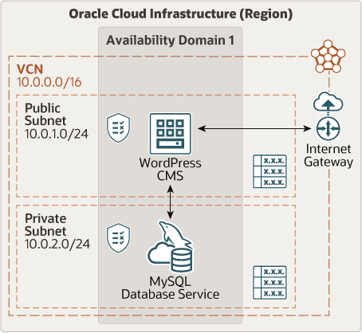

# oci-arch-wordpress-mds

## Prerequisites

- Permission to `manage` the following types of resources in your Oracle Cloud Infrastructure tenancy: `vcns`, `internet-gateways`, `route-tables`, `security-lists`, `subnets`, `mysql-family`, and `instances`.

- Quota to create the following resources: 1 VCN, 2 subnets, 1 Internet Gateway, 1 NAT Gateway, 2 route rules, 1 MySQL Database System (MDS) instance, and 1 compute instance (Wordpress CMS).

If you don't have the required permissions and quota, contact your tenancy administrator. See [Policy Reference](https://docs.cloud.oracle.com/en-us/iaas/Content/Identity/Reference/policyreference.htm), [Service Limits](https://docs.cloud.oracle.com/en-us/iaas/Content/General/Concepts/servicelimits.htm), [Compartment Quotas](https://docs.cloud.oracle.com/iaas/Content/General/Concepts/resourcequotas.htm).

## Deploy Using Oracle Resource Manager

1. Click [](https://console.us-phoenix-1.oraclecloud.com/resourcemanager/stacks/create?region=home&zipUrl=https://github.com/oracle-quickstart/oci-arch-wordpress-mds/raw/master/resource-manager/oci-arch-wordpress-mds.zip)

    If you aren't already signed in, when prompted, enter the tenancy and user credentials.

2. Review and accept the terms and conditions.

3. Select the region where you want to deploy the stack.

4. Follow the on-screen prompts and instructions to create the stack.

5. After creating the stack, click **Terraform Actions**, and select **Plan**.

6. Wait for the job to be completed, and review the plan.

    To make any changes, return to the Stack Details page, click **Edit Stack**, and make the required changes. Then, run the **Plan** action again.

7. If no further changes are necessary, return to the Stack Details page, click **Terraform Actions**, and select **Apply**. 

## Deploy Using the Terraform CLI

### Clone the Module

Now, you'll want a local copy of this repo. You can make that with the commands:

```
    git clone https://github.com/oracle-quickstart/oci-arch-wordpress-mds.git
    cd oci-arch-wordpress-mds
    ls
```

### Prerequisites
First off, you'll need to do some pre-deploy setup.  That's all detailed [here](https://github.com/cloud-partners/oci-prerequisites).

Create a `terraform.tfvars` file, and specify the following variables:

```
# Authentication
tenancy_ocid         = "<tenancy_ocid>"
user_ocid            = "<user_ocid>"
fingerprint          = "<finger_print>"
private_key_path     = "<pem_private_key_path>"

# Region
region = "<oci_region>"

# Availablity Domain 
availablity_domain_name = "<availablity_domain_name>"

# Compartment
compartment_ocid = "<compartment_ocid>"

# MySQL DBSystem Admin Password 
admin_password = "<admin_password>"

# WordPress MySQL Database User Password
wp_password = "<wp_user_password>"

# WordPress Themes to be installed by WP-CLI (minimum 1 theme)
wp_themes = "lodestar,twentysixteen"

# WordPress Plugins to be installed by WP-CLI (minimum 1 plugin)
wp_plugins = "hello-dolly,elementor"

# WordPress Site Title
wp_site_title = "<WordPress_site_title>"
       
# WordPress WP-Admin User
wp_site_admin_user = "<wp-admin_user>"

# WordPress WP-Admin Password
wp_site_admin_pass = "<wp-admin_password>"

# WordPress WP-Admin e-mail address
wp_site_admin_email = "<wp-admin_email>"

````

### Create the Resources
Run the following commands:

    terraform init
    terraform plan
    terraform apply


### Testing your Deployment
After the deployment is finished, you can access WP-Admin by picking wordpress_wp-admin_url output and pasting into web browser window. You can also verify initial content of your blog by using wordpress_public_ip:

````
wordpress_wp-admin_url = http://193.122.198.19/wp-admin/
wordpress_public_ip = 193.122.198.19
`````

### Destroy the Deployment
When you no longer need the deployment, you can run this command to destroy the resources:

    terraform destroy

## Architecture Diagram




